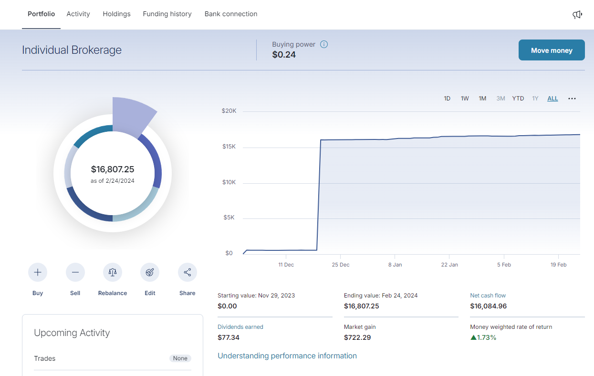

## About
This plugin is built buy a community of investors to make viewing assessts on M1 a little bit easier. It is geared towards individuals who need to take clear screenshots or record clear and consise videos of their portfolios so all values are displayed in frame. 

## Before Plugin

## After Plugin

## Development
This Chrome Extension is a work in progress. Please see the issues tab if you would like to make it better.